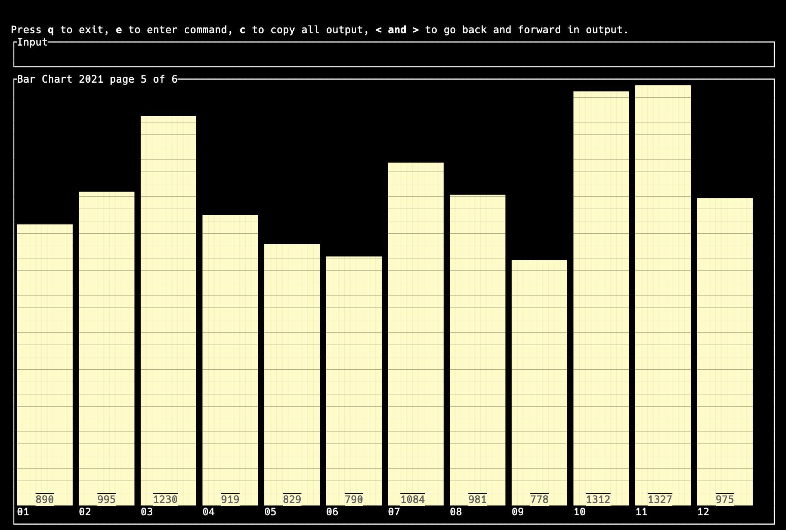
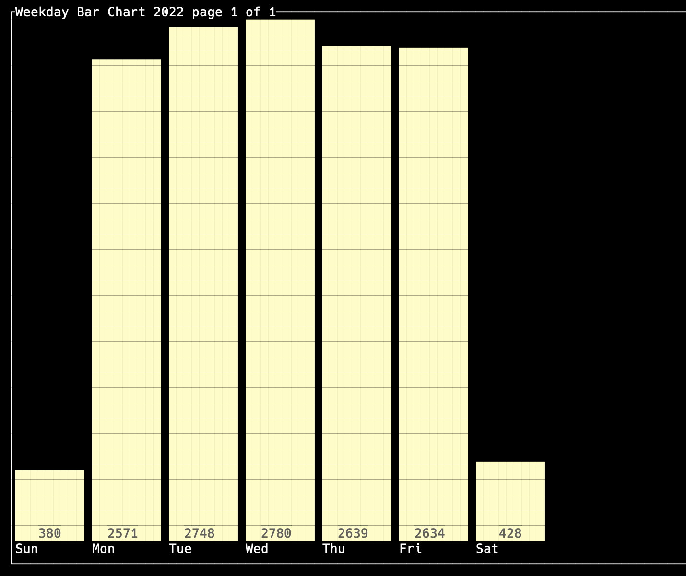

# Krustens

Get statistics from your listening history. Currently only supports Spotify and Apple Music, but I plan to add support for histories from other services in the future.

## Usage
**Required:** At least one file downloaded from Spotify or Apple Music of your listening history.

For Spotify it can be downloaded from the `Account` -> `Privacy` page after requesting an export of your data. Krustens can use either the history file from the `Account Data` (the listens from the last year), or the extended streaming history. In the resulting export it will be a file named similar to `StreamingHistory0.json` or `endsong_0.json`. This program can use any number of these.

For Apple Music you can request this data using Apple's https://privacy.apple.com/account page and specifically requesting the media information. There should be a file that has `Track Play History` in the name. This is currently the only file supported by `krustens`.

### Generating Listen Events
`Krustens` reads the streaming history files and generates events it can read back later to generate the statistics (for now). It does this to attempt to ensure that it does not double-count any duplicate track plays between the history files. `Krustens` (for now) counts any song played for less than 10s as "skipped", or less than 10% of the song duration if the listen is from Apple Music (Spotify does not provide that information in the history file and this app does not call out to Spotify to check).

Start the app with `cargo run`, start entering commands (hit `e`) and enter the command `process`. You will be able to specify an input folder where the listen files are located, and then the app will loop through all of the files processing the listen events from them. Once they have all been processed, you will be able to get info out of the krustens database with the other commands. These are all stored locally in the local database, it does not need to be run again afterwards.

Anytime in the future when listens are processed, the app will check to see if they're already in the database and not save them again.

### Getting some statistics
You can ask for a number of different statistics such as
    - top artists, by year or all time
    - top songs
    - most skipped songs

It can also help show you information like:
    - songs played from an artist
    - give you random artists to listen to
    - what artists you listened to on a specific day

And you can display a chart of a count of your listens

by month

or weekday

